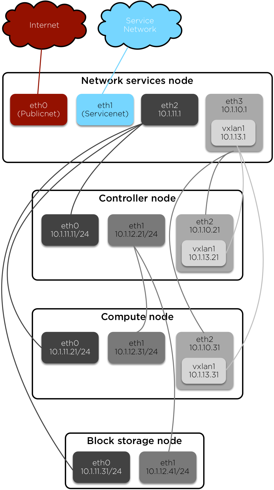

===================================================
How-To: OpenStack on Rackspace Ubuntu Cloud Servers
===================================================

This how-to provides instructions for building the prerequisite
infrastructure for installing multi-host OpenStack environments on Rackspace
cloud servers using the official OpenStack installation guide.

The infrastructure contains two OpenStack nodes operating on private
(tenant) networks managed by a network services (jump/firewall) node.
The latter protects the OpenStack nodes from direct internet access and
provides internet connectivity to instances in the environment.

Overview
~~~~~~~~

-  Prepare the Rackspace cloud environment.
-  Build and configure the network services (jump/firewall) node.
-  Build and configure OpenStack nodes.
-  Install and configure OpenStack services with minor modifications to
   the official installation guide.

Network architecture
~~~~~~~~~~~~~~~~~~~~

Prepare cloud environment
~~~~~~~~~~~~~~~~~~~~~~~~~

Keys
----

Upload a public key.

Networks
--------

In the Rackspace Cloud Control Panel, select :guilabel:`Networks` in the
:guilabel:`Networking` tab, and create the following networks:

#. management

   -  10.1.11.0/24

#. internal

   -  10.1.12.0/24

#. external

   -  10.1.13.0/24

Orchestration
~~~~~~~~~~~~~

You can save time by orchestrating basic server creation:

#. In the **Orchestration** menu, select **Custom Template**.

#. Paste the contents of :download:`ubuntu.yml` into the template editor.

#. Replace ``key_name: mykey`` with the name of your SSH key.

   .. warning::

      The template does not display login passwords, so if you do not specify
      a working SSH key you cannot access any of the nodes.

#. Click **Create Template and Launch Stack**.

The template builds the following resources:

-  network-services node
-  controller node
-  compute node
-  block node
-  block storage volume (attached to the block node)

The resources are all attached to the appropriate networks, however you still
must manually configure the interfaces on each node.

.. important::

   The root password for the controller, compute, and block nodes is: **stack**

Launch servers
~~~~~~~~~~~~~~

Network services node (network-services)
----------------------------------------

#. Create a cloud server. If you orchestrated server creation, skip this step.

   - OS: Ubuntu 16.04 (Xenial Xerus) PVHVM
   - Flavor: 1 GB General Purpose v1
   - Networks: PublicNet, ServiceNet

   .. note::

      Adding multiple tenant networks simultaneously yields inconsistent
      network interface device names. This guide adds one tenant network at a
      time as it becomes necessary. Also, changing tenant networks after
      configuration erases changes made in this guide.

#. Access the node from the internet using the IP address assigned by
   Rackspace.

   .. code-block:: console

      ssh root@<network-services_IP_ADDRESS>

#. Update node.

   .. code-block:: console

      apt-get update && apt-get dist-upgrade

#. Install additional packages.

   .. code-block:: console

      apt-get install ntp shorewall

#. Reboot node.

#. Add the *management* network to node if you did not orchestrate server
   creation.

#. Add the *external* network to node if you did not orchestrate server
   creation.

#. Configure additional network interfaces.

#. Edit the :file:`/etc/network/interfaces` file.

   .. code-block:: text

      # Label management
      auto eth2
      iface eth2 inet static
      address 10.1.11.1
      netmask 255.255.255.0

      # Label external
      auto eth3
      iface eth3 inet static
      address 10.1.10.1
      netmask 255.255.255.0

      # Label vxlan1
      auto vxlan1
      iface vxlan1 inet static
      pre-up ip link add vxlan1 type vxlan id 1 group 239.0.0.1 dev eth3
      address 10.1.13.1
      netmask 255.255.255.0
      post-down ip link del vxlan1

#. Restart the network interfaces.

   .. code-block:: console

      ifdown eth2 && ifup eth2
      ifdown eth3 && ifup eth3

#. Bring up the vxlan1 interface.

   .. code-block:: console

      ifup vxlan1

#. Configure the firewall service.

   #.  Edit the :file:`/etc/shorewall/shorewall.conf` file.

       .. code-block:: ini

          IP_FORWARDING=On

   #. Create a :file:`/etc/shorewall/interfaces` file.

      .. code-block:: text

         ext eth0 - routefilter,tcpflags
         rax eth1
         osm1 eth2
         ose1 eth3
         os1t vxlan1

   #. Create a :file:`/etc/shorewall/masq` file.

      .. code-block:: text

         eth0 10.1.11.0/24
         eth0 10.1.13.0/24

   #. Create a :file:`/etc/shorewall/policy` file.

      .. code-block:: text

         $FW all ACCEPT
         ext all REJECT
         rax all ACCEPT
         osm1 all ACCEPT
         ose1 all ACCEPT
         os1t all ACCEPT

   #. Create a :file:`/etc/shorewall/rules` file.

      .. code-block:: text

         Ping/ACCEPT ext $FW
         SSH/ACCEPT ext $FW
         #DNAT ext osm1:10.1.11.11  tcp    www
         #DNAT ext osm1:10.1.11.11  tcp    6080

      .. note::

         Uncomment the DNAT rules and restart Shorewall as necessary to
         enable remote access to the dashboard and instance consoles in the
         OpenStack environment.

   #. Create a :file:`/etc/shorewall/zones` file.

      .. code-block:: text

         fw firewall
         ext ipv4
         rax ipv4
         osm1 ipv4
         ose1 ipv4
         os1t ipv4

   #. Edit the :file:`/etc/default/shorewall` file.

      .. code-block:: ini

         startup=1

   #. Check the shorewall configuration.

      .. code-block:: console

         # shorewall check

   #. Start the firewall service.

      .. code-block:: console

         # service shorewall start

      .. note::

         Restart the firewall service whenever the network services
         node is rebooted.

#. Test network connectivity to the internet by pinging openstack.org:

   .. code-block:: console

      # ping openstack.org
      PING openstack.org (162.242.140.107) 56(84) bytes of data.
      64 bytes from 162.242.140.107: icmp_seq=1 ttl=50 time=181 ms
      64 bytes from 162.242.140.107: icmp_seq=2 ttl=50 time=180 ms
      ...

#. Generate an ssh key for accessing other nodes:

   .. code-block:: console

      # ssh-keygen -t rsa -b 2048 -C "ns1" -P "" -f .ssh/id_rsa

OpenStack controller node (controller)
--------------------------------------

If you orchestrated server creation, skip to :ref:`configure network interfaces
<controller-net>`.

#. Create a cloud server, removing all networks except the *management*
   network.

   - OS: Ubuntu 16.04 (Xenial Xerus) PVHVM
   - Flavor: 8 GB General Purpose v1
   - Network: management

#. In the cloud control panel, add the **internal** network to the
   node.

#. In the cloud control panel, add the **external** network to the
   node.

   .. note::

      The node cannot access the internet without additional
      configuration.

   .. _controller-net:

#. Access the node from the network services node (network-services) using the
   IP address assigned by Rackspace on the *management* network:

   .. code-block:: console

      # ssh-copy-id -i .ssh/id_rsa.pub root@<controller_IP_ADDRESS>
      # ssh root@<controller_IP_ADDRESS>

#. Configure network interfaces.

#. Edit the :file:`/etc/network/interfaces` file.

   .. code-block:: text

      # Label management
      auto eth0
      iface eth0 inet static
          address 10.1.11.11
          netmask 255.255.255.0
          gateway 10.1.11.1
          dns-nameserver 72.3.128.241 72.3.128.240

      # Label internal
      auto eth1
      iface eth1 inet static
          address 10.1.12.21
          netmask 255.255.255.0

      # Label external
      auto eth2
      iface eth2 inet static
          address 10.1.10.21
          netmask 255.255.255.0

      # Label vxlan1
      auto vxlan1
      iface vxlan1 inet static
          pre-up ip link add vxlan1 type vxlan id 1 group 239.0.0.1 dev eth2
          address 10.1.13.21
          netmask 255.255.255.0
          post-down ip link del vxlan1

#. Edit the :file:`/etc/hosts` file.

   .. code-block:: text

      # controller
      10.1.11.11 controller

      # compute
      10.1.11.21 compute

      # block
      10.1.11.31 block

   .. note::

      Comment out or remove any existing lines containing
      *controller*.

#. Reboot the node.

#. Access the node from the network services node using the new IP
   address on the *management* network.

   .. code-block:: console

      ssh root@10.1.11.11

#. Test network connectivity to the internet. For example:

   .. code-block:: console

      ping -c 4 openstack.org

#. Update the node.

   .. code-block:: console

      apt-get update && apt-get dist-upgrade

#. Reboot the node.

   .. code-block:: console

      # reboot

OpenStack compute node (compute)
--------------------------------

If you orchestrated server creation, skip to :ref:`configure network interfaces
<compute-net>`.

#. Create a cloud server, removing all networks except the *management*
   network.

   - OS: Ubuntu 16.04 (Xenial Xerus) PVHVM
   - Flavor:
     - 3.75 GB Compute v1 (supports several CirrOS instances)
     - 7.5 GB Compute v1 (supports a couple of Ubuntu/Fedora instances)
   - Network: management

#. In the cloud control panel, add the **internal** network to the node.

#. In the cloud control panel, add the **external** network to the node.

   .. note::

      The node cannot access the internet without additional
      configuration.

   .. _compute-net:

#. Access the node from the network services node (network-services) using the
   IP address assigned by RAX on *management* network.

   .. code-block:: console

      # ssh-copy-id -i .ssh/id_rsa.pub root@<compute_IP_ADDRESS>
      # ssh root@<compute_IP_ADDRESS>

#. Configure network interfaces.

#. Edit the :file:`/etc/network/interfaces` file.

   .. code-block:: text

      # Label management
      auto eth0
      iface eth0 inet static
          address 10.1.11.21
          netmask 255.255.255.0
          gateway 10.1.11.1
          dns-nameserver 72.3.128.241 72.3.128.240

      # Label internal
      auto eth1
      iface eth1 inet static
          address 10.1.12.31
          netmask 255.255.255.0

      # Label external
      auto eth2
      iface eth2 inet static
          address 10.1.10.31
          netmask 255.255.255.0

      # Label vxlan1
      auto vxlan1
      iface vxlan1 inet static
      pre-up ip link add vxlan1 type vxlan id 1 group 239.0.0.1 dev eth2
      address 10.1.13.31
      netmask 255.255.255.0
      post-down ip link del vxlan1

#. Edit the :file:`/etc/hosts` file.

   .. code-block:: ini

      # controller
      10.1.11.11 controller

      # compute
      10.1.11.21 compute

      # block
      10.1.11.31 block

   .. note::

      Comment out or remove any existing lines containing
      *compute*.

#. Reboot the node.

#. Access the node from the network services node using the new IP
   address on the *management* network.

   .. code-block:: console

      ssh root@10.1.11.21

#. Test network connectivity to the internet. For example:

   .. code-block:: console

      ping -c 4 openstack.org

#. Update the node.

   .. code-block:: console

      apt-get update && apt-get dist-upgrade

#. Reboot the node.

   .. code-block:: console

      # reboot

OpenStack block storage node (block)
~~~~~~~~~~~~~~~~~~~~~~~~~~~~~~~~~~~~

If you orchestrated server creation, skip to :ref:`configure network interfaces
<block-net>`.

#. Create a cloud server, removing all networks except the
   **management** network.

   - OS: 16.04 (Xenial Xerus) PVHVM
   - 4 GB General Purpose v1
   - Network: management

#. In the cloud control panel, add the **internal** network to the
   node.

   .. note::

      The node cannot access the internet without additional configuration.

   .. _block-net:

#. Access the node from the network services node using the IP address
   assigned by Rackspace on the **management** network:

   .. code-block:: console

      # ssh-copy-id -i .ssh/id_rsa.pub root@<block_IP_ADDRESS>
      # ssh root@<block_IP_ADDRESS>

#. Edit the :file:`/etc/network/interfaces` file:

   .. code-block:: ini

      # Label management
      auto eth0
      iface eth0 inet static
          address 10.1.11.31
          netmask 255.255.255.0
          gateway 10.1.11.1
          dns-nameserver 72.3.128.241 72.3.128.240

      # Label internal
      auto eth1
      iface eth1 inet static
          address 10.1.12.41
          netmask 255.255.255.0

#. Edit the :file:`/etc/hosts` file:

   .. code-block:: ini

      # controller
      10.1.11.11 controller

      # compute
      10.1.11.21 compute

      #block
      10.1.11.31 block

   .. note::

      Comment out or remove any existing lines containing
      *block*.

#. Reboot the node.

#. Access the node from the network services node using the new IP
   address on the *management* network.

   .. code-block:: console

      ssh root@10.1.11.31

#. Test network connectivity to the internet. For example:

   .. code-block:: console

      ping -c 4 openstack.org

#. Update the node.

   .. code-block:: console

      apt-get update && apt-get dist-upgrade

#. If performing pre-release testing, install the repository for the relevant
   release candidate. For example:

   .. code-block:: console

      # apt-get install software-properties-common
      # add-apt-repository cloud-archive:ocata

#. Reboot the node:

   .. code-block:: console

      # reboot

Create a block storage volume (block1)
--------------------------------------

If you orchestrated server creation, skip to :ref:`services`.

#. In the Rackspace Cloud Control Panel, select
   :guilabel:`Block Storage Volumes` in the :guilabel:`Storage` tab, and
   create the following volume named **block1**:

   - Standard (SATA) 75GB

#. Attach the volume to the **block** server.

#. After the device is attached, note the device name. For example,
   `/dev/xvdb`. Use this value when setting up block storage for OpenStack.

.. _services:

Install and configure OpenStack services
~~~~~~~~~~~~~~~~~~~~~~~~~~~~~~~~~~~~~~~~

Use the `Installation Tutorials and Guides
<http://docs.openstack.org/ocata/install-guide-ubuntu/>`_ with
the following changes:

- Configuring the basic environment on all nodes:

  -  Skip the network configuration sections.

  -  Use 10.1.11.1 (network services node) as the NTP server.

- Configuring the Compute service on the compute node:

  -  Use *qemu* instead of *kvm* virtualization.

- Configuring the Networking service on the controller node:

  -  Add the *vxlan1* interface as a port on the *br-ex* bridge.

- Creating initial networks.

  - Use the following command for the subnet on the external network:

    .. code-block:: console

       neutron subnet-create --name provider \
       --allocation-pool start=10.1.13.101,end=10.1.13.200 \
       --enable-dhcp --gateway 10.1.13.1 provider 10.1.13.0/24

  .. note::

     After performing the initial tenant network creation procedure,
     try pinging 10.1.13.101 from the network services node.
